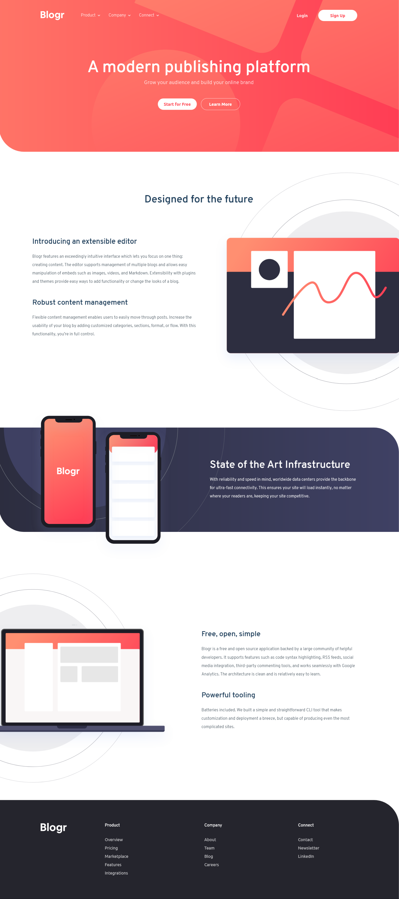

# Frontend Mentor - Blogr landing page solution

This is a solution to the [Blogr landing page challenge on Frontend Mentor](https://www.frontendmentor.io/challenges/blogr-landing-page-EX2RLAApP). Frontend Mentor challenges help you improve your coding skills by building realistic projects. 

## Table of contents

- [Frontend Mentor - Blogr landing page solution](#frontend-mentor---blogr-landing-page-solution)
  - [Table of contents](#table-of-contents)
  - [Overview](#overview)
    - [The challenge](#the-challenge)
    - [Screenshot](#screenshot)
    - [Links](#links)
  - [My process](#my-process)
    - [Built with](#built-with)
    - [What I learned](#what-i-learned)
    - [Continued development](#continued-development)
    - [Useful resources](#useful-resources)
  - [Author](#author)

**Note: Delete this note and update the table of contents based on what sections you keep.**

## Overview

### The challenge

Users should be able to:

- View the optimal layout for the site depending on their device's screen size
- See hover states for all interactive elements on the page

### Screenshot
**Desktop**

**Mobile**

### Links

- Solution URL: [Github](https://github.com/gylim0604/FrontEndMentor-Blogr-Landing-Page)
- Live Site URL: [Vercel](https://front-end-mentor-blogr-landing-page.vercel.app/)

## My process

### Built with
- [Next.js](https://nextjs.org/) - React framework
- [Chakra-UI](https://chakra-ui.com/) - Component Library
- Mobile-first workflow

### What I learned

So first time using Next.js and Chakra UI to build a site based on an existing design. Was a good practice as I was able to learn quite alot about the frameworks. Honestly not sure if it was necessary for this particular site, but it was a good practice and I will probably try out this combination for my next few solutions too. It would be too much if I were to go into detail about everything I learnt so here are some of the key points:
- using [custom themes](https://chakra-ui.com/docs/theming/customize-theme) to extend the base Chakra UI theme, basically acts like a base stylesheet.
- SVGs can be imported as the Box component and used as icons, which I quite like. More can be found on this [guide](https://dev.to/studio_hungry/chakra-ui-external-link-with-svg-icon-12e5).
- still trying to get a hang of responsive images, especially srcset. Ended up using the picture tag instead as it was easier to understand and implement. 
  
There's still quite a lot , but mostly directed towards Chakra UI and it's specifics. 

### Continued development

I probably won't develop this any further. 

### Useful resources

- [www.internetingishard.com](https://www.internetingishard.com/html-and-css/responsive-images/) - I feel this is my favourite guide on responsive images so far. 
- [dev.to](https://dev.to/studio_hungry/chakra-ui-external-link-with-svg-icon-12e5) - This helped me figure out how to use svg as icons in chakra ui. 

## Author

- Frontend Mentor - [@yourusername](https://www.frontendmentor.io/profile/gylim0604)

